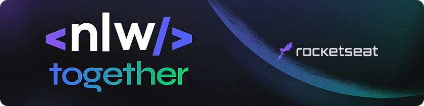
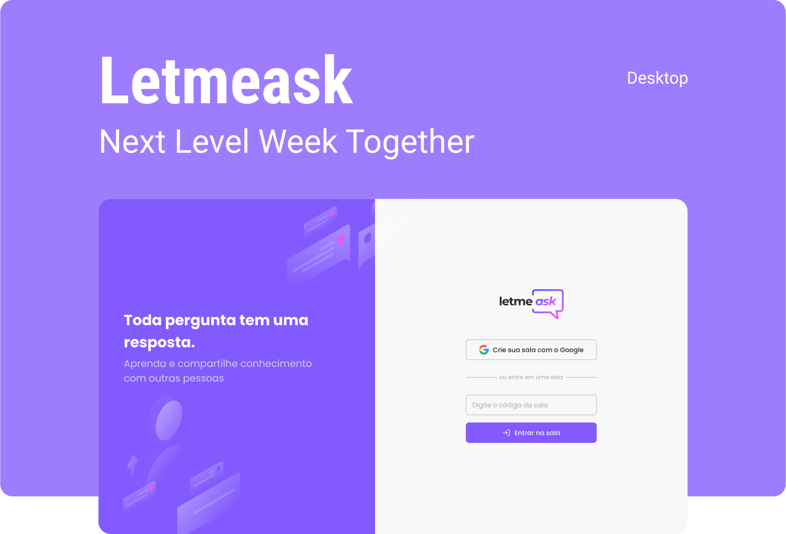

<p >
    
</p>
<br>

<h1 align="center" >this project was created in the React mission at NLW #06
</h1>

<p align="center" >Letmeask it's platform thought to "content creators" organize your live chats and answer them questions</p>

<br>

<p >
    
</p>

<br>

# 🤖 Technologies

This project was developed with this Technologies

- [React](https://reactjs.org)
- [Firebase](https://firebase.google.com/)
- [TypeScript](https://www.typescriptlang.org/)

# 🕹️ How started

Clone the project and go to the correct folder

```bash
$ git clone https://github.com/RamonMota/letmeask.git
```
<br>


Install the dependencies
```bash
$ npm install
```
<br>

Start the project
```bash

$ npm start
```
You will run this project on your browser in the address http://localhost:3000.

### 💡 Pay attention
Remember, to start this project you will need create a account [Firebase](https://firebase.google.com/) and a "Realtime Database" project.

# 🗺️ Layout

You can see the layout project between the link below:

- [Layout Web](https://www.figma.com/file/u0BQK8rCf2KgzcukdRRCWh/Letmeask/duplicate)


🤙 Peace
